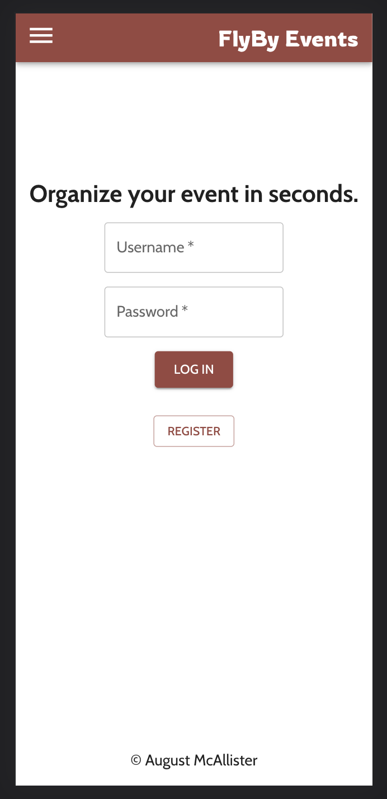
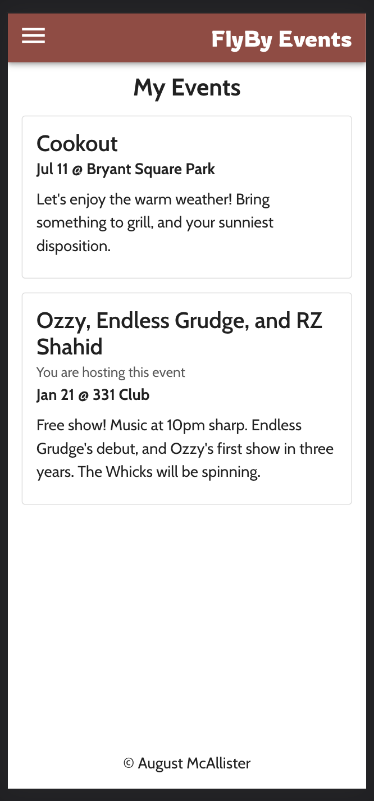

<a name="readme-top"></a>

<!-- PROJECT SHIELDS -->
<!--
*** I'm using markdown "reference style" links for readability.
*** Reference links are enclosed in brackets [ ] instead of parentheses ( ).
*** See the bottom of this document for the declaration of the reference variables
*** for contributors-url, forks-url, etc. This is an optional, concise syntax you may use.
*** https://www.markdownguide.org/basic-syntax/#reference-style-links
-->
[![Contributors][contributors-shield]][contributors-url]
[![Forks][forks-shield]][forks-url]
[![Stargazers][stars-shield]][stars-url]
[![Issues][issues-shield]][issues-url]
[![MIT License][license-shield]][license-url]
[![LinkedIn][linkedin-shield]][linkedin-url]


<!-- PROJECT LOGO -->
<br />
<div align="center">
  <a href="https://github.com/ozzythecoder/flyby-events-solo-project">
    
  </a>

<h3 align="center">FlyBy Events</h3>

  <p align="center">
    project_description
    <br />
    <a href="https://github.com/ozzythecoder/flyby-events-solo-project/issues">Report Bug</a>
    ·
    <a href="https://github.com/ozzythecoder/flyby-events-solo-project/issues">Request Feature</a>
  </p>
</div>


<!-- TABLE OF CONTENTS -->
<details>
  <summary>Table of Contents</summary>
  <ol>
    <li>
      <a href="#about-the-project">About The Project</a>
      <ul>
        <li><a href="#built-with">Built With</a></li>
      </ul>
    </li>
    <li>
      <a href="#getting-started">Getting Started</a>
      <ul>
        <li><a href="#prerequisites">Prerequisites</a></li>
        <li><a href="#installation">Installation</a></li>
      </ul>
    </li>
    <li><a href="#usage">Usage</a></li>
    <li><a href="#roadmap">Roadmap</a></li>
    <li><a href="#contributing">Contributing</a></li>
    <li><a href="#license">License</a></li>
    <li><a href="#contact">Contact</a></li>
    <li><a href="#acknowledgments">Acknowledgments</a></li>
  </ol>
</details>


<!-- ABOUT THE PROJECT -->
## About The Project
<center>


</center>


<p align="right">(<a href="#readme-top">back to top</a>)</p>


### Built With

* [![React][React.js]][React-url]
* [![Node][Node.js]][Node-url]
* [![MUI]][MUI-url]
* [![Postgresql]][Postgresql-url]
* [![Redux]][Redux-url]
* [![Redux-Saga]][Redux-saga-url]
* [![Swal2]][Swal2-url]
* [![Luxon.js]][Luxon-url]

<p align="right">(<a href="#readme-top">back to top</a>)</p>


<!-- GETTING STARTED -->
## Getting Started

This is an example of how you may give instructions on setting up your project locally.
To get a local copy up and running follow these simple example steps.

### Prerequisites

This is an example of how to list things you need to use the software and how to install them.
* npm
  ```sh
  npm install npm@latest -g
  ```

### Installation

1. Get a free API Key at [https://example.com](https://example.com)
2. Clone the repo
   ```sh
   git clone https://github.com/ozzythecoder/flyby-events-solo-project.git
   ```
3. Install NPM packages
   ```sh
   npm install
   ```
4. Enter your API in `config.js`
   ```js
   const API_KEY = 'ENTER YOUR API';
   ```

<p align="right">(<a href="#readme-top">back to top</a>)</p>


<!-- USAGE EXAMPLES -->
## Usage

Use this space to show useful examples of how a project can be used. Additional screenshots, code examples and demos work well in this space. You may also link to more resources.

_For more examples, please refer to the [Documentation](https://example.com)_

<p align="right">(<a href="#readme-top">back to top</a>)</p>


<!-- ROADMAP -->
## Roadmap

- [ ] Feature 1
- [ ] Feature 2
- [ ] Feature 3
    - [ ] Nested Feature

See the [open issues](https://github.com/ozzythecoder/flyby-events-solo-project/issues) for a full list of proposed features (and known issues).

<p align="right">(<a href="#readme-top">back to top</a>)</p>


<!-- CONTRIBUTING -->
## Contributing

Contributions are what make the open source community such an amazing place to learn, inspire, and create. Any contributions you make are **greatly appreciated**.

If you have a suggestion that would make this better, please fork the repo and create a pull request. You can also simply open an issue with the tag "enhancement".
Don't forget to give the project a star! Thanks again!

1. Fork the Project
2. Create your Feature Branch (`git checkout -b feature/AmazingFeature`)
3. Commit your Changes (`git commit -m 'Add some AmazingFeature'`)
4. Push to the Branch (`git push origin feature/AmazingFeature`)
5. Open a Pull Request

<p align="right">(<a href="#readme-top">back to top</a>)</p>


<!-- LICENSE -->
## License

Distributed under the MIT License. See `LICENSE.txt` for more information.

<p align="right">(<a href="#readme-top">back to top</a>)</p>


<!-- CONTACT -->
## Contact

August McAllister - august.chm@gmail.com

Project Link: [https://github.com/ozzythecoder/flyby-events-solo-project](https://github.com/ozzythecoder/flyby-events-solo-project)

<p align="right">(<a href="#readme-top">back to top</a>)</p>


<!-- ACKNOWLEDGMENTS -->
## Acknowledgments

* []()
* []()
* []()

<p align="right">(<a href="#readme-top">back to top</a>)</p>


<!-- MARKDOWN LINKS & IMAGES -->
<!-- https://www.markdownguide.org/basic-syntax/#reference-style-links -->
[contributors-shield]: https://img.shields.io/github/contributors/ozzythecoder/flyby-events-solo-project.svg?style=for-the-badge
[contributors-url]: https://github.com/ozzythecoder/flyby-events-solo-project/graphs/contributors
[forks-shield]: https://img.shields.io/github/forks/ozzythecoder/flyby-events-solo-project.svg?style=for-the-badge
[forks-url]: https://github.com/ozzythecoder/flyby-events-solo-project/network/members
[stars-shield]: https://img.shields.io/github/stars/ozzythecoder/flyby-events-solo-project.svg?style=for-the-badge
[stars-url]: https://github.com/ozzythecoder/flyby-events-solo-project/stargazers
[issues-shield]: https://img.shields.io/github/issues/ozzythecoder/flyby-events-solo-project.svg?style=for-the-badge
[issues-url]: https://github.com/ozzythecoder/flyby-events-solo-project/issues
[license-shield]: https://img.shields.io/github/license/ozzythecoder/flyby-events-solo-project.svg?style=for-the-badge
[license-url]: https://github.com/ozzythecoder/flyby-events-solo-project/blob/master/LICENSE.txt
[linkedin-shield]: https://img.shields.io/badge/-LinkedIn-black.svg?style=for-the-badge&logo=linkedin&colorB=555
[linkedin-url]: https://linkedin.com/in/august-mcallister
[product-screenshot]: ./documentation/images/login-screenshot.png
[Node.js]: https://img.shields.io/badge/Node.JS-20232A?style=for-the-badge&logo=node.js&logoColor=61DAFB
[Node-url]: https://nodejs.org/en/
[React.js]: https://img.shields.io/badge/React-20232A?style=for-the-badge&logo=react&logoColor=61DAFB
[React-url]: https://reactjs.org/
[Postgresql]: https://img.shields.io/badge/PostgreSQL-20232A?style=for-the-badge&logo=postgresql&logoColor=61DAFB
[Postgresql-url]: https://www.postgresql.org/
[Redux]: https://img.shields.io/badge/Redux-20232A?style=for-the-badge&logo=redux&logoColor=61DAFB
[Redux-url]: https://redux.js.org/
[Redux-Saga]: https://img.shields.io/badge/Redux/Saga-20232A?style=for-the-badge&logo=reduxsaga&logoColor=61DAFB
[Redux-saga-url]: https://redux-saga.js.org/
[MUI]: https://img.shields.io/badge/MUI%20&%20Material%20Design-20232A?style=for-the-badge&logo=materialdesign&logoColor=61DAFB
[MUI-url]: https://mui.com/core/
[Swal2]: https://img.shields.io/badge/SweetAlert2-20232A?style=for-the-badge
[Swal2-url]: https://sweetalert2.github.io/
[Luxon.js]: https://img.shields.io/badge/Luxon.js-20232A?style=for-the-badge
[Luxon-url]: https://moment.github.io/luxon/#/